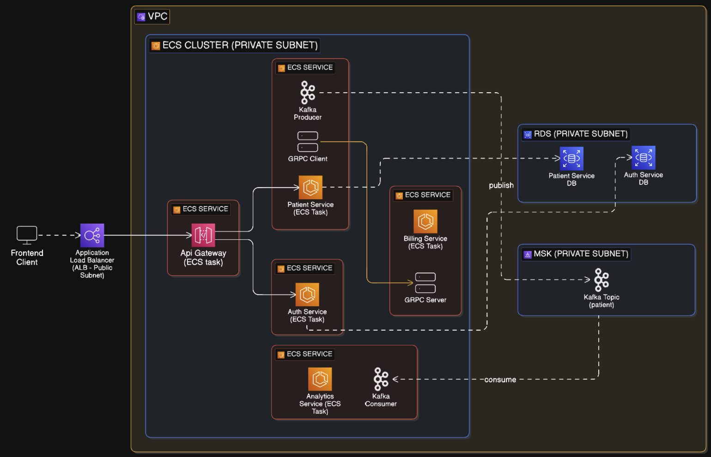

# Patient Management System

A production-grade, cloud-native microservices architecture built with Java and Spring Boot ecosystem. This system demonstrates **Enterprise-level Design patterns** for healthcare management, implementing distributed systems principles with comprehensive inter-service communication strategies, event-driven architecture, and API gateway patterns.

## Overview

The Patient Management System is a distributed application architected using microservices design patterns to handle patient data, authentication, billing, and analytics operations. The system leverages containerization, message-driven communication, and multiple communication protocols to ensure scalability, resilience, and maintainability.

Built with a focus on production readiness, this project incorporates industry-standard practices including:
- API Gateway pattern for centralized routing and cross-cutting concerns
- Service-to-service communication via both REST and gRPC protocols
- Event-driven architecture using Apache Kafka for asynchronous operations
- Comprehensive testing strategies (unit, integration, and REST API testing)
- OpenAPI specification for automated API documentation
- Docker containerization for consistent deployment environments
- Cloud deployment capabilities with AWS integration

---

### System Architecture



---

## Features

### Microservices Architecture
- **API Gateway (Spring Cloud Gateway)**: Centralized entry point implementing routing, load balancing, and request filtering. Handles authentication validation and provides a unified interface to downstream services.
- **Service Mesh Communication**: Hybrid communication model supporting both synchronous (REST/gRPC) and asynchronous (Kafka) patterns.
- **Independent Service Deployment**: Each microservice is independently deployable with isolated data stores following the database-per-service pattern.

### Inter-Service Communication
- **RESTful APIs**: HTTP-based communication for client-facing operations with JSON payloads.
- **gRPC Protocol**: High-performance RPC framework for internal service-to-service communication, utilizing Protocol Buffers for efficient serialization.
- **Event-Driven Messaging**: Apache Kafka integration for asynchronous, decoupled communication enabling event sourcing and CQRS patterns.

### Data Persistence & Management
- **PostgreSQL Databases**: Relational data storage with separate database instances per service ensuring data isolation.
- **JPA/Hibernate**: ORM layer with schema migration capabilities and transaction management.

### Security & Authentication
- **JWT-Based Authentication**: Stateless authentication using JSON Web Tokens with role-based access control (RBAC).
- **Spring Security Integration**: Comprehensive security configuration with BCrypt password encoding and authorization filters.
- **API Gateway Security**: Centralized token validation and request authorization.

### Testing & Quality Assurance
- **Integration Testing**: End-to-end service interaction testing with REST Assured framework.
- **Unit Testing**: JUnit 5-based component and service layer testing.
- **Automated Test Suites**: CI/CD-ready test automation for deployment pipelines.

### API Documentation
- **OpenAPI 3.0 Specification**: Auto-generated API documentation using SpringDoc.
- **Swagger UI Integration**: Interactive API exploration and testing interface.
- **Protocol Buffer Definitions**: gRPC service contracts with `.proto` schema files.

### DevOps & Cloud Readiness
- **Docker Containerization**: Multi-stage Docker builds for optimized container images.
- **AWS Deployment**: Cloud-native deployment configuration with automated testing in AWS environments.
- **Development Debugging**: Remote debugging support with JDWP configuration.
- **Infrastructure as Code**: LocalStack integration for local AWS service emulation.

### Monitoring & Observability
- **Distributed Logging**: Centralized logging strategy across microservices.
- **Analytics Service**: Dedicated service for business intelligence and operational metrics.

---

## Tech Stack

### Backend Framework
- **Java 17+**: Core programming language
- **Spring Boot 3.4.x**: Application framework and dependency injection
- **Spring Cloud Gateway**: API Gateway implementation
- **Spring Security**: Authentication and authorization
- **Spring Data JPA**: Data access layer
- **Spring Kafka**: Kafka integration

### Communication Protocols
- **REST**: HTTP/JSON for synchronous communication
- **gRPC**: Protocol Buffers-based RPC framework
- **Apache Kafka**: Distributed event streaming platform

### Data Storage
- **PostgreSQL**: Primary relational database

### Testing
- **JUnit 5**: Unit testing framework
- **REST Assured**: REST API integration testing
- **Spring Boot Test**: Testing utilities and annotations
- **Mockito**: Mocking framework

### API Documentation
- **SpringDoc OpenAPI**: OpenAPI 3.0 documentation generator
- **Swagger UI**: Interactive API documentation interface

### Build & Deployment
- **Maven**: Dependency management and build automation
- **Docker**: Containerization platform
- **Protocol Buffers Compiler**: gRPC code generation
- **AWS**: Cloud deployment platform

### Development Tools
- **JDWP**: Remote debugging protocol
- **Maven Wrapper**: Version-locked Maven execution

---

## Architecture

### Microservices

1. **API Gateway** (Port 4004)
   - Routes requests to appropriate microservices
   - JWT token validation
   - Load balancing and request filtering

2. **Auth Service**
   - User authentication and authorization
   - JWT token generation and validation
   - User management with PostgreSQL persistence

3. **Patient Service**
   - Patient CRUD operations
   - Event publishing to Kafka
   - gRPC client for billing service

4. **Billing Service**
   - Billing account management
   - gRPC server for inter-service communication
   - Event consumption from Kafka

5. **Analytics Service**
   - Event-driven analytics processing
   - Kafka consumer for patient events
   - Business intelligence data aggregation

---

# Service Configuration & Setup

### Environment Variables

```
JAVA_TOOL_OPTIONS=-agentlib:jdwp=transport=dt_socket,server=y,suspend=n,address=*:5005;
SPRING_DATASOURCE_PASSWORD=password;
SPRING_DATASOURCE_URL=jdbc:postgresql://patient-service-db:5432/db;
SPRING_DATASOURCE_USERNAME=admin_user;
SPRING_JPA_HIBERNATE_DDL_AUTO=update;
SPRING_KAFKA_BOOTSTRAP_SERVERS=kafka:9092;
SPRING_SQL_INIT_MODE=always
```

# Billing Service

---

## gRPC Setup

Add the following to the `<dependencies>` section
```
<!--GRPC -->
<dependency>
    <groupId>io.grpc</groupId>
    <artifactId>grpc-netty-shaded</artifactId>
    <version>1.69.0</version>
</dependency>
<dependency>
    <groupId>io.grpc</groupId>
    <artifactId>grpc-protobuf</artifactId>
    <version>1.69.0</version>
</dependency>
<dependency>
    <groupId>io.grpc</groupId>
    <artifactId>grpc-stub</artifactId>
    <version>1.69.0</version>
</dependency>
<dependency> <!-- necessary for Java 9+ -->
    <groupId>org.apache.tomcat</groupId>
    <artifactId>annotations-api</artifactId>
    <version>6.0.53</version>
    <scope>provided</scope>
</dependency>
<dependency>
    <groupId>net.devh</groupId>
    <artifactId>grpc-spring-boot-starter</artifactId>
    <version>3.1.0.RELEASE</version>
</dependency>
<dependency>
    <groupId>com.google.protobuf</groupId>
    <artifactId>protobuf-java</artifactId>
    <version>4.29.1</version>
</dependency>

```

Replace the `<build>` section with the following

```

<build>
    <extensions>
        <!-- Ensure OS compatibility for protoc -->
        <extension>
            <groupId>kr.motd.maven</groupId>
            <artifactId>os-maven-plugin</artifactId>
            <version>1.7.0</version>
        </extension>
    </extensions>
    <plugins>
        <!-- Spring boot / maven  -->
        <plugin>
            <groupId>org.springframework.boot</groupId>
            <artifactId>spring-boot-maven-plugin</artifactId>
        </plugin>

        <!-- PROTO -->
        <plugin>
            <groupId>org.xolstice.maven.plugins</groupId>
            <artifactId>protobuf-maven-plugin</artifactId>
            <version>0.6.1</version>
            <configuration>
                <protocArtifact>com.google.protobuf:protoc:3.25.5:exe:${os.detected.classifier}</protocArtifact>
                <pluginId>grpc-java</pluginId>
                <pluginArtifact>io.grpc:protoc-gen-grpc-java:1.68.1:exe:${os.detected.classifier}</pluginArtifact>
            </configuration>
            <executions>
                <execution>
                    <goals>
                        <goal>compile</goal>
                        <goal>compile-custom</goal>
                    </goals>
                </execution>
            </executions>
        </plugin>
    </plugins>
</build>

```

# Patient Service

---

## Environment Variables (complete list)
```bash
BILLING_SERVICE_ADDRESS=billing-service;
BILLING_SERVICE_GRPC_PORT=9005;
JAVA_TOOL_OPTIONS=-agentlib:jdwp\=transport\=dt_socket,server\=y,suspend\=n,address\=*:5005;
SPRING_DATASOURCE_PASSWORD=password;
SPRING_DATASOURCE_URL=jdbc:postgresql://patient-service-db:5432/db;
SPRING_DATASOURCE_USERNAME=admin_user;
SPRING_JPA_HIBERNATE_DDL_AUTO=update;
SPRING_KAFKA_BOOTSTRAP_SERVERS=kafka:9092;
SPRING_SQL_INIT_MODE=always
```


## gRPC Setup

Add the following to the `<dependencies>` section
```
<!--GRPC -->
<dependency>
    <groupId>io.grpc</groupId>
    <artifactId>grpc-netty-shaded</artifactId>
    <version>1.69.0</version>
</dependency>
<dependency>
    <groupId>io.grpc</groupId>
    <artifactId>grpc-protobuf</artifactId>
    <version>1.69.0</version>
</dependency>
<dependency>
    <groupId>io.grpc</groupId>
    <artifactId>grpc-stub</artifactId>
    <version>1.69.0</version>
</dependency>
<dependency> <!-- necessary for Java 9+ -->
    <groupId>org.apache.tomcat</groupId>
    <artifactId>annotations-api</artifactId>
    <version>6.0.53</version>
    <scope>provided</scope>
</dependency>
<dependency>
    <groupId>net.devh</groupId>
    <artifactId>grpc-spring-boot-starter</artifactId>
    <version>3.1.0.RELEASE</version>
</dependency>
<dependency>
    <groupId>com.google.protobuf</groupId>
    <artifactId>protobuf-java</artifactId>
    <version>4.29.1</version>
</dependency>

```

Replace the `<build>` section with the following

```

<build>
    <extensions>
        <!-- Ensure OS compatibility for protoc -->
        <extension>
            <groupId>kr.motd.maven</groupId>
            <artifactId>os-maven-plugin</artifactId>
            <version>1.7.0</version>
        </extension>
    </extensions>
    <plugins>
        <!-- Spring boot / maven  -->
        <plugin>
            <groupId>org.springframework.boot</groupId>
            <artifactId>spring-boot-maven-plugin</artifactId>
        </plugin>

        <!-- PROTO -->
        <plugin>
            <groupId>org.xolstice.maven.plugins</groupId>
            <artifactId>protobuf-maven-plugin</artifactId>
            <version>0.6.1</version>
            <configuration>
                <protocArtifact>com.google.protobuf:protoc:3.25.5:exe:${os.detected.classifier}</protocArtifact>
                <pluginId>grpc-java</pluginId>
                <pluginArtifact>io.grpc:protoc-gen-grpc-java:1.68.1:exe:${os.detected.classifier}</pluginArtifact>
            </configuration>
            <executions>
                <execution>
                    <goals>
                        <goal>compile</goal>
                        <goal>compile-custom</goal>
                    </goals>
                </execution>
            </executions>
        </plugin>
    </plugins>
</build>

```

## Kafka Container

Copy/paste this line into the environment variables when running the container in intellij
```
KAFKA_CFG_ADVERTISED_LISTENERS=PLAINTEXT://kafka:9092,EXTERNAL://localhost:9094;KAFKA_CFG_CONTROLLER_LISTENER_NAMES=CONTROLLER;KAFKA_CFG_CONTROLLER_QUORUM_VOTERS=0@kafka:9093;KAFKA_CFG_LISTENER_SECURITY_PROTOCOL_MAP=CONTROLLER:PLAINTEXT,EXTERNAL:PLAINTEXT,PLAINTEXT:PLAINTEXT;KAFKA_CFG_LISTENERS=PLAINTEXT://:9092,CONTROLLER://:9093,EXTERNAL://:9094;KAFKA_CFG_NODE_ID=0;KAFKA_CFG_PROCESS_ROLES=controller,broker
```

## Kafka Producer Setup (Patient Service)

Add the following to `application.properties`
```
spring.kafka.consumer.key-deserializer=org.apache.kafka.common.serialization.StringDeserializer
spring.kafka.consumer.value-deserializer=org.apache.kafka.common.serialization.ByteArrayDeserializer
```


# Notification Service

---

## Environment Vars

```
SPRING_KAFKA_BOOTSTRAP_SERVERS=kafka:9092
```

## Protobuf/Kafka 

Dependencies (add in addition to whats there)

```
<dependency>
    <groupId>org.springframework.kafka</groupId>
    <artifactId>spring-kafka</artifactId>
    <version>3.3.0</version>
</dependency>

<dependency>
    <groupId>com.google.protobuf</groupId>
    <artifactId>protobuf-java</artifactId>
    <version>4.29.1</version>
</dependency>
```

Update the build section in pom.xml with the following

```
    <build>
        <extensions>
            <!-- Ensure OS compatibility for protoc -->
            <extension>
                <groupId>kr.motd.maven</groupId>
                <artifactId>os-maven-plugin</artifactId>
                <version>1.7.0</version>
            </extension>
        </extensions>
        <plugins>
            <plugin>
                <groupId>org.springframework.boot</groupId>
                <artifactId>spring-boot-maven-plugin</artifactId>
            </plugin>

            <plugin>
                <groupId>org.xolstice.maven.plugins</groupId>
                <artifactId>protobuf-maven-plugin</artifactId>
                <version>0.6.1</version>
                <configuration>
                    <protocArtifact>com.google.protobuf:protoc:3.25.5:exe:${os.detected.classifier}</protocArtifact>
                    <pluginId>grpc-java</pluginId>
                    <pluginArtifact>io.grpc:protoc-gen-grpc-java:1.68.1:exe:${os.detected.classifier}</pluginArtifact>
                </configuration>
                <executions>
                    <execution>
                        <goals>
                            <goal>compile</goal>
                            <goal>compile-custom</goal>
                        </goals>
                    </execution>
                </executions>
            </plugin>
        </plugins>
    </build>
```


# Auth service

Dependencies (add in addition to whats there)

```
        <dependency>
            <groupId>org.springframework.boot</groupId>
            <artifactId>spring-boot-starter-security</artifactId>
        </dependency>

        <dependency>
            <groupId>org.springframework.boot</groupId>
            <artifactId>spring-boot-starter-data-jpa</artifactId>
        </dependency>
        <dependency>
            <groupId>org.springframework.boot</groupId>
            <artifactId>spring-boot-starter-web</artifactId>
        </dependency>
        <dependency>
            <groupId>org.springframework.boot</groupId>
            <artifactId>spring-boot-starter-test</artifactId>
            <scope>test</scope>
        </dependency>
        <dependency>
            <groupId>org.springframework.security</groupId>
            <artifactId>spring-security-test</artifactId>
            <scope>test</scope>
        </dependency>
        <dependency>
            <groupId>io.jsonwebtoken</groupId>
            <artifactId>jjwt-api</artifactId>
            <version>0.12.6</version>
        </dependency>
        <dependency>
            <groupId>io.jsonwebtoken</groupId>
            <artifactId>jjwt-impl</artifactId>
            <version>0.12.6</version>
            <scope>runtime</scope>
        </dependency>
        <dependency>
            <groupId>io.jsonwebtoken</groupId>
            <artifactId>jjwt-jackson</artifactId>
            <version>0.12.6</version>
            <scope>runtime</scope>
        </dependency>
        <dependency>
            <groupId>org.postgresql</groupId>
            <artifactId>postgresql</artifactId>
            <scope>runtime</scope>
        </dependency>
        <dependency>
            <groupId>org.springdoc</groupId>
            <artifactId>springdoc-openapi-starter-webmvc-ui</artifactId>
            <version>2.6.0</version>
        </dependency>
        <dependency>
          <groupId>com.h2database</groupId>
          <artifactId>h2</artifactId>
        </dependency>
       
```

## Environment Variables

```
SPRING_DATASOURCE_PASSWORD=password
SPRING_DATASOURCE_URL=jdbc:postgresql://auth-service-db:5432/db
SPRING_DATASOURCE_USERNAME=admin_user
SPRING_JPA_HIBERNATE_DDL_AUTO=update
SPRING_SQL_INIT_MODE=always
```


## Data.sql

```sql
-- Ensure the 'users' table exists
CREATE TABLE IF NOT EXISTS "users" (
    id UUID PRIMARY KEY,
    email VARCHAR(255) UNIQUE NOT NULL,
    password VARCHAR(255) NOT NULL,
    role VARCHAR(50) NOT NULL
);

-- Insert the user if no existing user with the same id or email exists
INSERT INTO "users" (id, email, password, role)
SELECT '223e4567-e89b-12d3-a456-426614174006', 'testuser@test.com',
       '$2b$12$7hoRZfJrRKD2nIm2vHLs7OBETy.LWenXXMLKf99W8M4PUwO6KB7fu', 'ADMIN'
WHERE NOT EXISTS (
    SELECT 1
    FROM "users"
    WHERE id = '223e4567-e89b-12d3-a456-426614174006'
       OR email = 'testuser@test.com'
);


```


# Auth Service DB

## Environment Variables

```
POSTGRES_DB=db;POSTGRES_PASSWORD=password;POSTGRES_USER=admin_user
```
